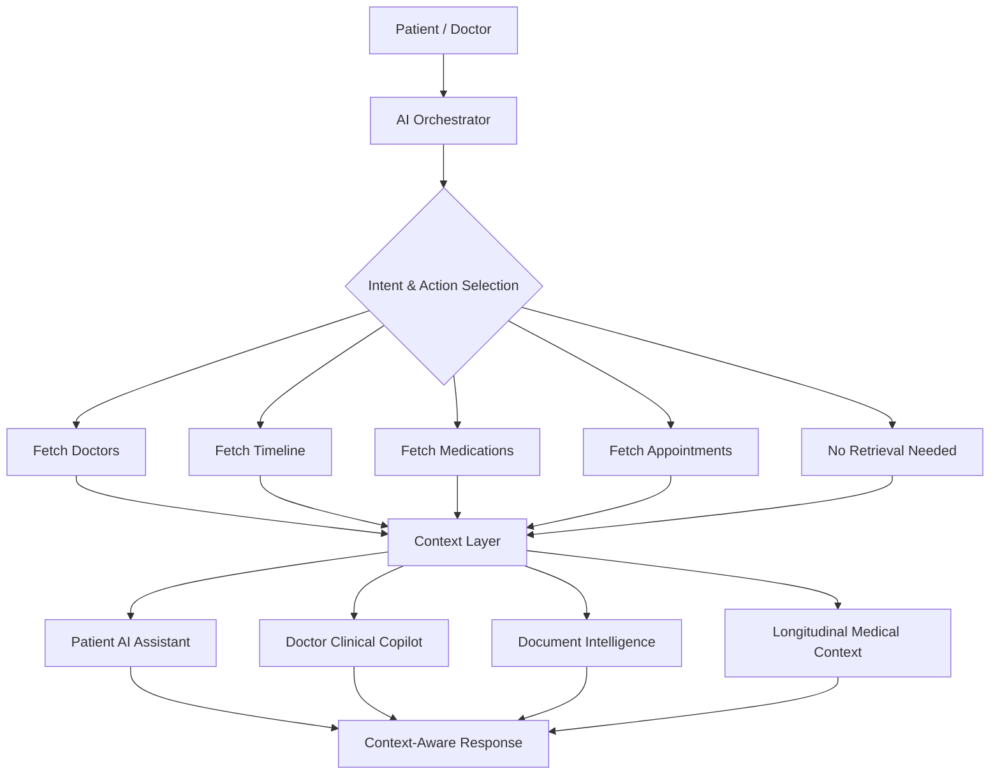

# Kshema

### Agentic AI for Connected, Context-Aware Healthcare Workflows

Kshema coordinates specialized AI workflows to understand medical documents, retrieve longitudinal patient context, assist patients, and support clinicians without automating critical medical decisions.

[](https://react.dev/)
[](https://www.typescriptlang.org/)
[](https://vitejs.dev/)
[](https://nodejs.org/)
[](https://expressjs.com/)
[](https://ai.google.dev/)
[](https://groq.com/)

---

## 2. The Problem

Healthcare workflows are fragmented across medical reports, appointments, longitudinal records, patient queries, and clinician systems. Patients and doctors repeatedly search for context, interpret documents, and coordinate next steps manually, causing delays, missed information, and inconsistent workflows.

---

## 3. The Solution

Kshema introduces an AI orchestration layer that interprets user intent, retrieves relevant application context, and routes that context to specialized AI workflows for patients, clinicians, document analysis, and longitudinal medical history. By anchoring AI reasoning to verified platform data, Kshema enables autonomous workflow coordination while keeping clinical decision-making firmly under human supervision.

---

## 4. Why Agentic AI?

| Agentic Capability | How Kshema Implements It |
|---|---|
| **Planning** | Intent classification and dynamic action routing (`FETCH_DOCTORS`, `FETCH_TIMELINE`, `FETCH_MEDICATIONS`, `FETCH_APPOINTMENTS`, `NONE`) |
| **Retrieval** | Selective fetching of application state: verified doctors, medical timeline, active medications, and appointments |
| **Reasoning** | Context-aware AI analysis that grounds responses in retrieved clinical data and demographic profile constraints |
| **Collaboration** | Coordinated execution between Patient AI, Doctor Copilot, Document Intelligence, and Medical Timeline services |
| **Execution** | Document text extraction, biomarker structuring, timeline updates, interactive UI widget injection, and appointment synchronization |
| **Human Oversight** | Clinical decisions, diagnoses, and prescriptions remain strictly under patient and clinician control |

---

## 5. Agentic Architecture



---

## 6. Specialized AI Workflows

### 🧑‍⚕️ Patient AI Assistant
* **Context-Aware Interaction:** Ingests the patient profile (allergies, chronic conditions, active medications) to ground responses and prevent generic filler.
* **Symptom Triage Guidance:** Evaluates symptom descriptions into urgency tiers (`RED`, `YELLOW`, `GREEN`) with specialty recommendations and home care tips.
* **Workflow Queries:** Answers queries regarding active medications, upcoming appointments, and past medical history with trilingual voice/text support (English, Hindi, Telugu).

### 🩺 Doctor Clinical Copilot
* **Clinician-Side Assistant:** Dedicated practitioner workspace assistant (`DoctorChatbot`) bound to the clinic schedule and active consultation queue.
* **Patient Context Summaries:** Compiles multi-year medical histories into standardized clinical briefings (Overview, Active Problems, Medications, Allergies, Lab Insights, Suggested Next Actions).
* **SOAP Note Assistance:** Generates structured Subjective, Objective, Assessment, and Plan drafts from consultation context for clinician review and editing.

### 📄 Document Intelligence
* **Medical Report Parsing:** Extracts text from uploaded lab reports via client-side PDF parsing (`pdfjs-dist`), backend stream parsing (`pdf-parse`), or multimodal vision.
* **Biomarker Structuring:** Identifies normal and abnormal markers, reference intervals, severity flags, and potential clinical implications.
* **Timeline Comparison & Review Flags:** Compares current lab results against past timeline entries to flag longitudinal trends (`Improving`, `Worsening`, `Stable`, `New`) and marks ambiguous handwriting with low-confidence warning indicators.

### 📅 Longitudinal Medical Context
* **Chronological Timeline:** Centralized patient health feed maintaining past clinical visits, lab reports, and medication histories.
* **Historical Retrieval:** Supplies chronological health context to downstream AI workflows to avoid repeat data entry.
* **Timeline Updates:** Ingests newly analyzed diagnostic summaries and imported records directly into the patient's continuous longitudinal record.

---

## 7. Example Multi-Step Workflow

**Scenario:** A patient asks:  
> *"Can you check whether my latest lab report is related to something in my previous records?"*

```
User Query 
   └──▶ AI Orchestrator (identifies intent: longitudinal record comparison)
          └──▶ Timeline Retrieval (fetches historical lab parameters from DB)
                 └──▶ Report Analysis (extracts biomarkers from uploaded document)
                        └──▶ Historical Comparison (evaluates current vs. previous values)
                               └──▶ Patient AI Response (presents trend analysis with review advice)
```

**How this demonstrates multi-step orchestration:**  
Instead of answering with generic definitions, the orchestrator classifies the intent, triggers database retrieval for past records, dispatches the document to the OCR structuring workflow, performs a longitudinal trend comparison, and synthesizes the final context-aware answer for the patient.

---

## 8. Key Features

| Feature | Implementation in Kshema |
|---|---|
| **AI Orchestration** | Intent-driven action classification routing queries to database retrieval before AI response generation |
| **Patient AI Assistant** | Grounded health companion with profile injection, anti-hallucination rules, and trilingual voice/text support |
| **Doctor Clinical Copilot** | Dedicated practitioner portal assistant providing 6-section patient briefings and editable SOAP note drafts |
| **Medical Timeline** | Multi-year chronological clinical feed storing encounters, lab tests, and imported records |
| **Medical Report / OCR Analysis** | PDF and multimodal document processing that extracts structured biomarkers and checks trend changes |
| **Prescription Safety Checks** | Detects smudged handwriting in physical prescriptions, sets `unclearFlag`, and prompts manual verification |
| **Appointment Workflows** | Specialty extraction from symptoms, doctor directory matching, and appointment slot reservations |
| **Simulated ABHA / ABDM Workflow** | Prototype OTP verification, dynamic consent lifecycle, and external record import from mock hospitals |
| **WhatsApp Channel Integration** | Omnichannel Meta WhatsApp Cloud webhook adapter normalizing text, PDF uploads, and interactive buttons |
| **Drug Interaction Support** | Cross-references active medications and patient allergies to flag potential adverse interactions |
| **Diet Planning** | Generates post-consultation meal recommendations based on diagnosis, medications, and food preferences |
| **Biomarker Trend Analytics** | Longitudinal time-series forecasting engine using OLS regression and Holt's exponential smoothing |
| **Medication Reconciliation** | Cross-hospital duplicate detection and brand-to-generic molecule matching using drug ontology |

---

## 9. Tech Stack

| Layer | Technology |
|---|---|
| **Frontend** | React 19, Vite 6, TypeScript 5.8 |
| **Styling** | Tailwind CSS v4, Motion (Framer) |
| **Backend** | Node.js 20+, Express 4.21 |
| **AI Providers** | Google Gemini (`gemini-2.5-flash`, `gemini-2.5-pro`), Groq SDK (`openai/gpt-oss-120b`, `qwen/qwen3.6-27b`, `llama-3.1-8b-instant`) |
| **Data Storage** | Multi-tenant file-based JSON storage (`data/users/`), optional Supabase client sync |
| **Document Processing** | `pdfjs-dist` (client), `pdf-parse` (server), Multimodal Vision |
| **Integrations** | Meta WhatsApp Cloud API (webhook adapter), Web Speech API (trilingual voice HUD) |

---

## 10. Setup

### 1. Clone & Install
```bash
git clone https://github.com/Rohit-Andhavarapu/HealthTribe-version-1.1.git
cd HealthTribe-version-1.1
npm install
```

### 2. Configure Environment Variables
Create a local `.env.local` file:
```env
AI_PROVIDER=gemini
GEMINI_API_KEY=your_gemini_api_key_here

# Optional: Groq inference
GROQ_API_KEY=your_groq_api_key_here
GROQ_MODEL=openai/gpt-oss-120b

# Optional: WhatsApp Cloud integration
WHATSAPP_PHONE_NUMBER_ID=
WHATSAPP_ACCESS_TOKEN=
WHATSAPP_VERIFY_TOKEN=healthtribe_secret_verify_token_2026
WHATSAPP_APP_SECRET=
```

### 3. Run Development Server
```bash
npm run dev
```
The server will start on `http://localhost:3000`.

---

## 11. Environment & Security

AI API keys are loaded strictly from backend environment variables and should never be committed to source control or exposed in frontend client code. Client sessions utilize partitioned tenant identification with isolated backend data boundaries.

---

## 12. Deployment & Demo

* **Live Demo:** Coming soon
* **Demo Video:** Coming soon

---

## 13. Current Scope

### Implemented Now
* AI Orchestration Layer with intent-to-action routing (`FETCH_*`)
* Context-grounded Patient AI Assistant with trilingual voice/text support
* Doctor Clinical Copilot with patient briefings and SOAP note drafting
* PDF and multimodal document parsing with biomarker structuring
* Longitudinal medical timeline with automatic report ingestion
* Prescription OCR with unclear handwriting detection and safety flags
* Statistical biomarker trajectory forecasting and medication reconciliation engines
* Simulated / prototype ABHA-ABDM verification and record import
* Meta WhatsApp Cloud API webhook adapter

### Not Claimed / Future Extensions
* Autonomous clinical diagnosis or autonomous medical decisions
* Autonomous prescription issuance without clinician sign-off
* Autonomous emergency dispatch or hospital transfer
* Live production connection to official National Health Authority (NHA) ABDM sandboxes
* Direct hardware telemetry streaming from physical wearable IoT devices

---

## 14. Clinical Safety Note

Kshema is designed as a healthcare workflow and decision-support prototype. AI-generated outputs are not a substitute for professional medical diagnosis or treatment. Critical medical decisions remain under human supervision.

---

## 15. Repository Naming Note

Kshema is the current project name. Some internal files, routes, components, and identifiers retain the legacy HealthTribe name to avoid unnecessary code-breaking changes.
